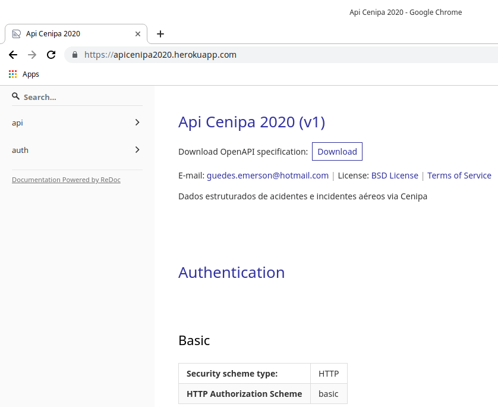
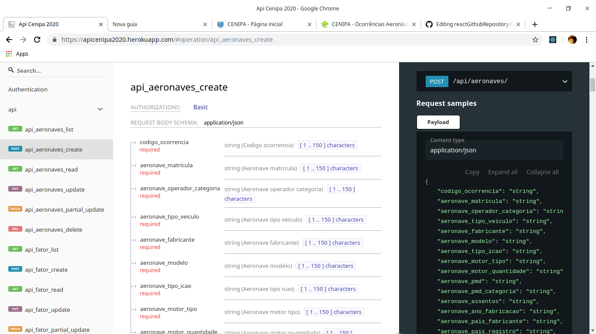
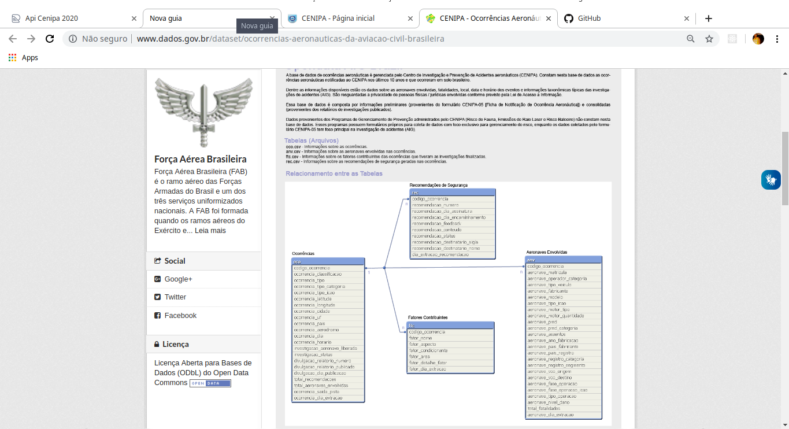

## Api CENIPA - Ocorrências Aeronáuticas na Aviação Civil Brasileira
##  Sobre a api:

Api que tem como fundamento, estruturar os dados tabulados fornecidos abertamente pelo CENIPA, com o objetivo de facilitar as integrações, consultas e pesquisas. 

<h1 align="center">
  
 
</h1>

<h1 align="center">
  
 
</h1>

<h1 align="center">
  
 
</h1>

#### 1. acesso a api: https://apicenipa2020.herokuapp.com

#### 2. Fonte de dados: http://www.dados.gov.br/dataset/ocorrencias-aeronauticas-da-aviacao-civil-brasileira
#### 3. links dos dados.csv:
http://sistema.cenipa.aer.mil.br/cenipa/media/opendata/oco.csv
http://sistema.cenipa.aer.mil.br/cenipa/media/opendata/anv.csv
http://sistema.cenipa.aer.mil.br/cenipa/media/opendata/ftc.csv
http://sistema.cenipa.aer.mil.br/cenipa/media/opendata/rec.csv
